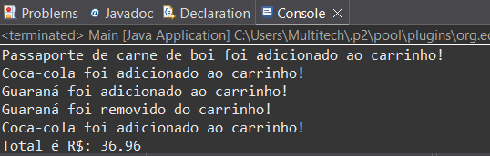

# . ݁₊ ⊹ . ݁˖ Carrinho de Compras em Java 🛒

Este projeto é uma implementação simples de um sistema de carrinho de compras em Java. O código permite adicionar itens ao carrinho, remover itens com base no código, calcular o valor total da compra e exibir informações sobre os produtos.

## ༘⋆📁 Estrutura do Projeto

O projeto é composto por três classes principais:

- Item: Representa um produto com nome, preço e código.
- Carrinho: Gerencia a lista de itens, com métodos para adicionar, remover e calcular o total.
- Main: Classe principal com o método main() para testar a funcionalidade.

## ₊˚⊹♡🧪 Exemplo de Funcionamento

Item item1 = new Item("Passaporte de carne de boi", 12.99, 1);

Item item2 = new Item("Passaporte de frango", 11.99, 2);

Item item3 = new Item("Coca-cola", 5.99, 3);

Item item4 = new Item("Guaraná", 4.99, 4);

Carrinho c = new Carrinho();

c.adicionarItem(item2);

c.adicionarItem(item1);

c.adicionarItem(item3);

c.adicionarItem(item4);

c.removerItem(4);

c.adicionarItem(item3);

c.calcularPreco();

## ₊ ⊹ ✧˚. Como executar
1.Clone o repositório:
git clone https://github.com/maryavila/Lanchonete

2.Compile e execute o programa no terminal (ou use uma IDE como Eclipse ou IntelliJ):

## ★ . ꜝꜞ📌 Requisitos
Java JDK 8 ou superior

## ★🎸🎧⋆｡ °⋆ Autor
Feito por Mariany Ávila
